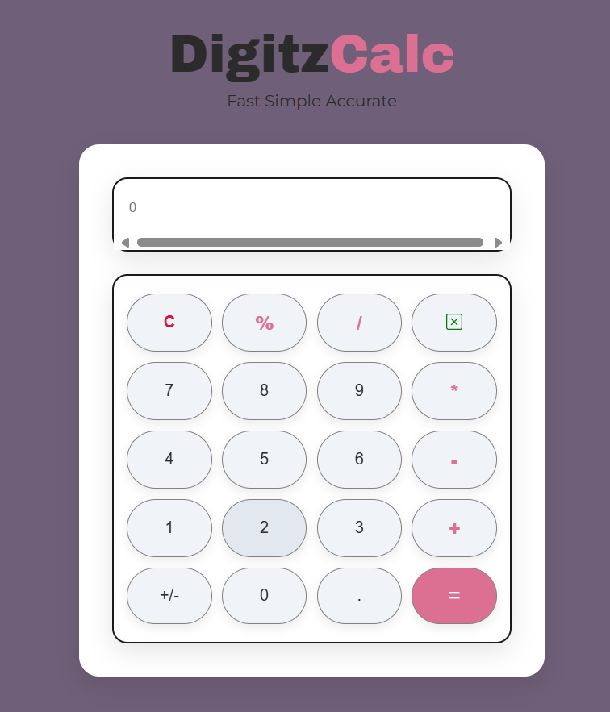

# DigitzCalc 🧮

A clean and modern calculator app built with HTML, CSS, and JavaScript — perfect for quick and simple math operations with a stylish interface.

## ✨ Features

- Responsive design (works on all screen sizes)
- Light pastel color theme for a modern look
- Click and keyboard input support
- Basic arithmetic operations: `+`, `−`, `×`, `÷`, `%`
- Delete last character (`X`)
- Clear all (`C`)
- Smooth button hover animations
- Developer footer with LinkedIn link

## 🚀 Live

## 🛠️ Tech Stack

- HTML5
- CSS3 
- JavaScript

## 📸 Preview

